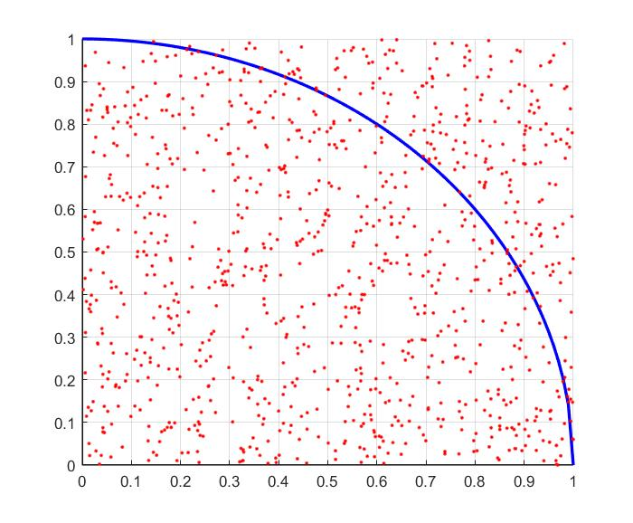

# ISE304 Systems Simulation (2021-2022 Spring, ISU)
This page includes coding exercises we did throughout the class. You can either clone this repo to your computer (and run files locally on your computer) or view them here.
* The file [`making_rvs.m`](making_rvs.m) includes MATLAB code on how we can generate various random variables, calculate any CDF values, sketch PDFs over an interval, pick random numbers, etc. It also includes a seed setting example.
* As an **assignment**, students were asked to approximate `pi` using simulation, specifically, pseudo-random numbers between 0 and 1. The approximation needs to be repeated for increasing sample sizes using a constant seed to see the converging behaviour. The file [`pi_est.m`](pi_est.m) includes my approach. One way is to do this is to calculate the proportion of pairs falling into the slice (quarter of a unit circle) below and use the analytical equation for its area.
<!---  --->

* The file [`mall_parking.m`](mall_parking.m) includes a simple MATLAB routine to calculate the number of servers needed for a shopping mall parking lot.

